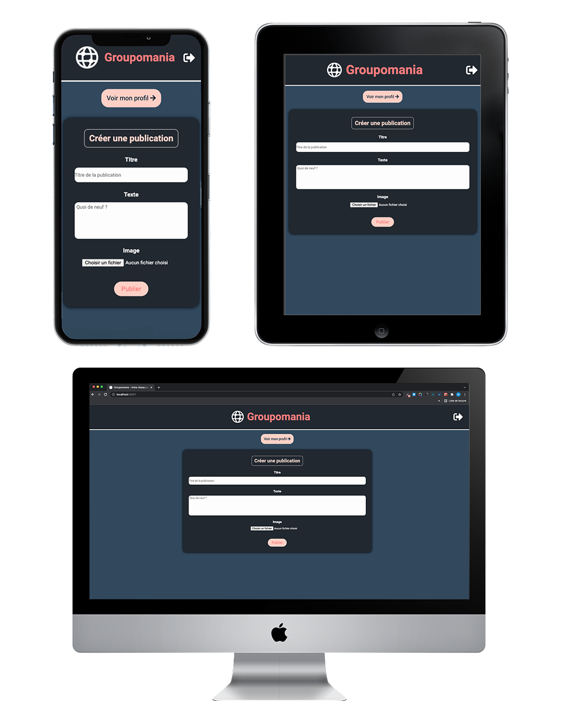

# - OpenClassrooms - Project 7 : Create a corporate social network -

## Groupomania




## Prerequisites

You will need to have Node and `npm` installed locally on your machine.
Then, you can clone the repository.


# Backend

## Setup

You will have to create your own .env file to add your environment variables and your own token.

Configure your `database` in the file `backend/config/.env`.

You have an example in the file at `backend/config/.env.example`.

```
    DB_HOST='localhost'
    DB_PORT='your_port_database'
    DB_NAME='your_database_name'
    DB_USER='your_username'
    DB_PASSWORD='your_database_password'

    SECRET_TOKEN='your_token'
```

From the folder `backend`:

```
    npm install
```

## Usage

Run the server:

```
    npx nodemon / node server
```


# Frontend

## Setup

From the folder `frontend`, you will find a .env file which contains the 'REACT_APP_URL' environment variable that you will have to adapt to your API port.

From the folder `frontend`:

```
    npm install
```

## Usage

Run the server:

```
    npm start
```

## Specificities

The website only accept email adress '@groupomania.com' to ensure that only members of Groupomania Company can register, so you will have to specify that when you register.

To create a moderator account, you will have to integrate manually on the database by placing the user column 'isAdmin' on '1', in order to avoid problems related to the security of the application.